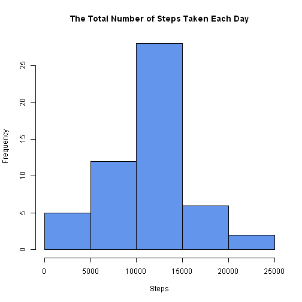

# Reproducible Research: Peer Assessment 1


```r
library(lattice)
```


## Loading and preprocessing the data

```r
activity <- read.csv(unz("activity.zip", "activity.csv"))
```


No data preproceesing was required.

## Make a histogram of the total number of steps taken each day


```r
agSumStepsDay <- aggregate(steps ~ date, data = activity, sum)
barplot(agSumStepsDay$steps, names.arg = agSumStepsDay$date, cex.names = 0.5, 
    cex.axis = 0.5, las = 2, col = "cornflowerblue", main = "The Total Number of Steps Taken Each Day", 
    xlab = "Date", ylab = "Steps")
```

 


## What is mean total number of steps taken per day?


```r
mean(agSumStepsDay$steps)
```

```
## [1] 10766
```


## What is median total number of steps taken per day?


```r
median(agSumStepsDay$steps)
```

```
## [1] 10765
```


## What is the average daily activity pattern?

### Make a time series plot of the 5-minute intervaland the average number of steps taken, averaged across all days


```r
agMeanStepsInterval <- aggregate(steps ~ interval, data = activity, mean)
xyplot(steps ~ interval, data = agMeanStepsInterval, type = "l", main = "average daily activity pattern", 
    xlab = "5-minute interval", ylab = "number of steps averaged across all days")
```

 


### Which 5-minute interval, on average across all the days in the dataset, contains the maximum number of steps?


```r
agMeanStepsInterval$interval[which(agMeanStepsInterval$steps == max(agMeanStepsInterval$steps))]
```

```
## [1] 835
```


## Imputing missing values

### Calculate and report the total number of missing values in the dataset (i.e. the total number of rows with NAs)


```r
sum(!complete.cases(activity))
```

```
## [1] 2304
```


### Devise a strategy for filling in all of the missing values in the dataset.

The strategy I chose was to use the mean for that that 5-minute interval.

### Create a new dataset that is equal to the original dataset but with the missing data filled in.


```r
NoNA <- activity
NARows = which(is.na(NoNA$steps))

for (i in NARows) {
    NoNA[i, 1] <- agMeanStepsInterval[which(agMeanStepsInterval$interval == 
        NoNA[i, 3]), 2]
}
```


### Make a histogram of the total number of steps taken each day


```r
agSumStepsDayNoNA <- aggregate(steps ~ date, data = NoNA, sum)
barplot(agSumStepsDayNoNA$steps, names.arg = agSumStepsDayNoNA$date, cex.names = 0.5, 
    cex.axis = 0.5, las = 2, col = "cornflowerblue", main = "The Total Number of Steps Taken Each Day", 
    xlab = "Date", ylab = "Steps")
```

 


###  Calculate and report the mean and median total number of steps taken per day


```r
mean(agSumStepsDayNoNA$steps)
```

```
## [1] 10766
```

```r
median(agSumStepsDayNoNA$steps)
```

```
## [1] 10766
```


As we can see, in this example the impact of imputing missing data on the estimates of the total daily number of steps in quite neglectable.


## Are there differences in activity patterns between weekdays and weekends?

```r
Sys.setlocale("LC_TIME", "English United States")
```

```
## [1] "English_United States.1252"
```

```r
days <- weekdays(as.Date(NoNA$date))
NoNA$DayType <- as.factor(as.character(factor(days, levels = c("Monday", "Tuesday", 
    "Wednesday", "Thursday", "Friday", "Saturday", "Sunday"), labels = c("weekday", 
    "weekday", "weekday", "weekday", "weekday", "weekend", "weekend"))))
```


Note: the purpose of the use of as.character and as.factor is to make two distinct levels (weekday/weekend) out of seven level (each one for each day of the week). 


```r
ag <- aggregate(steps ~ interval + DayType, data = NoNA, mean)
xyplot(steps ~ interval | DayType, data = ag, type = "l", main = "average daily activity pattern", 
    xlab = "5-minute interval", ylab = "number of steps averaged across all days", 
    layout = c(1, 3))
```

 

